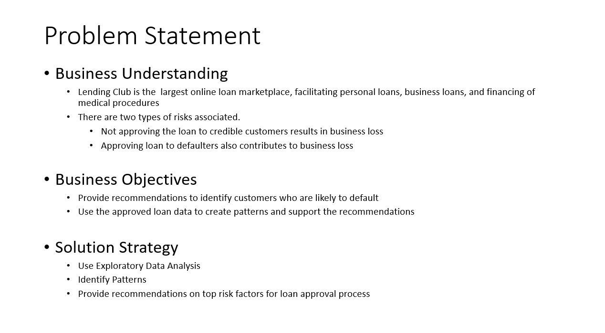
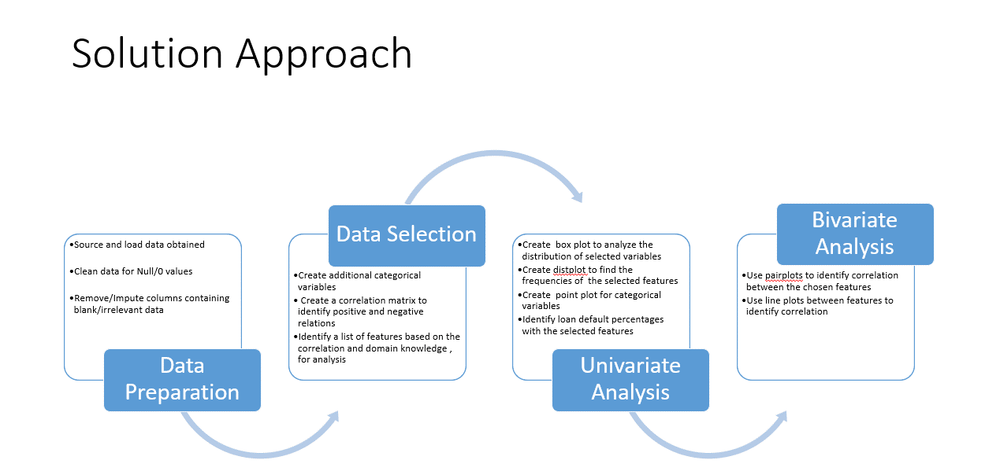
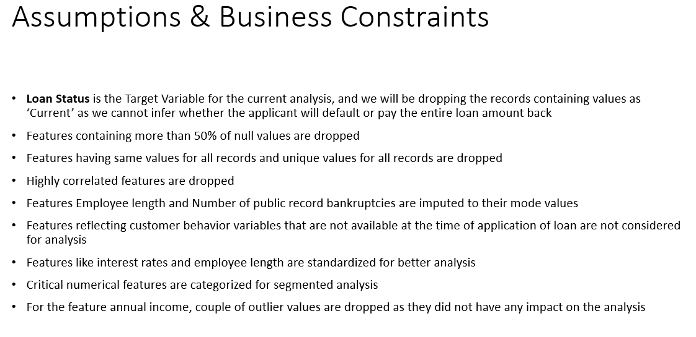
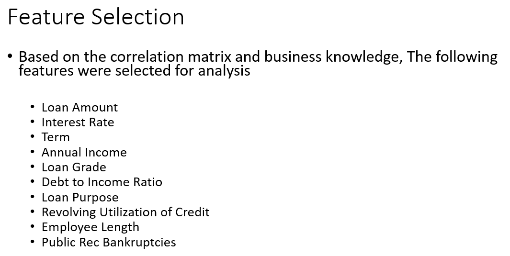
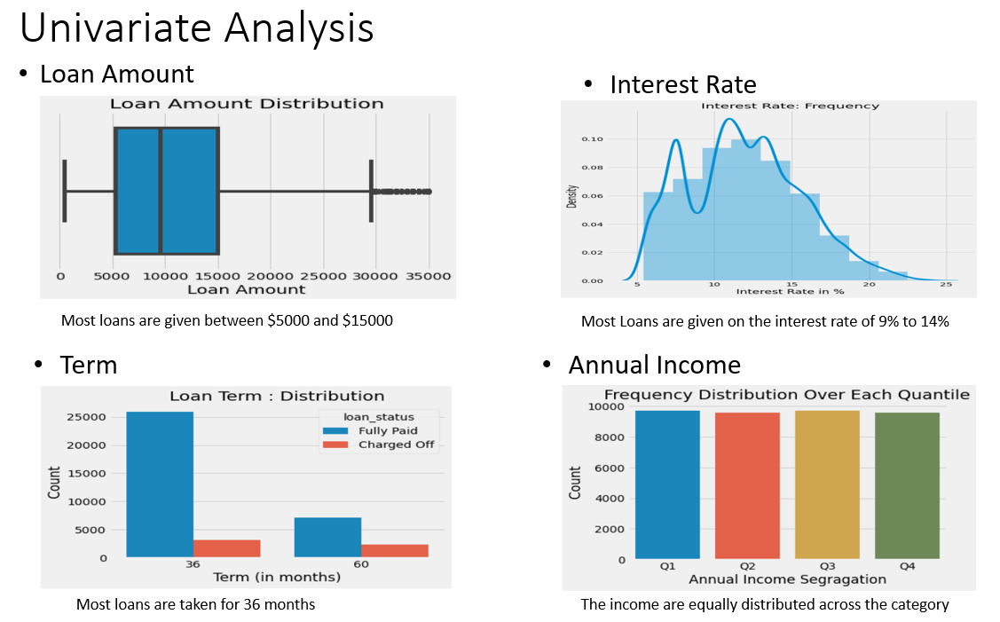
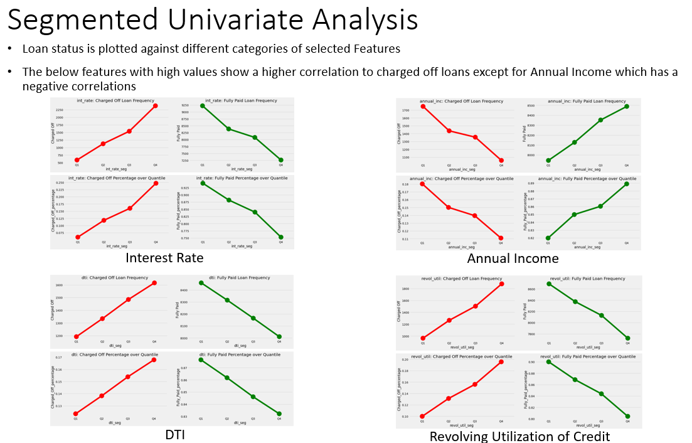
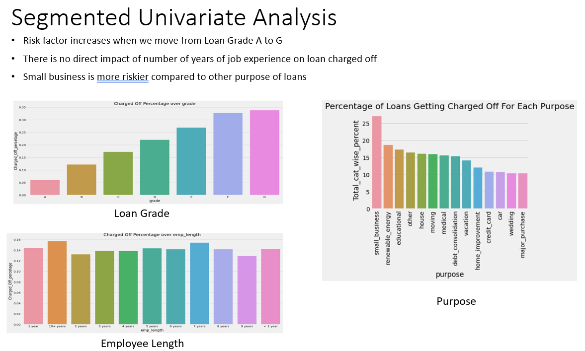
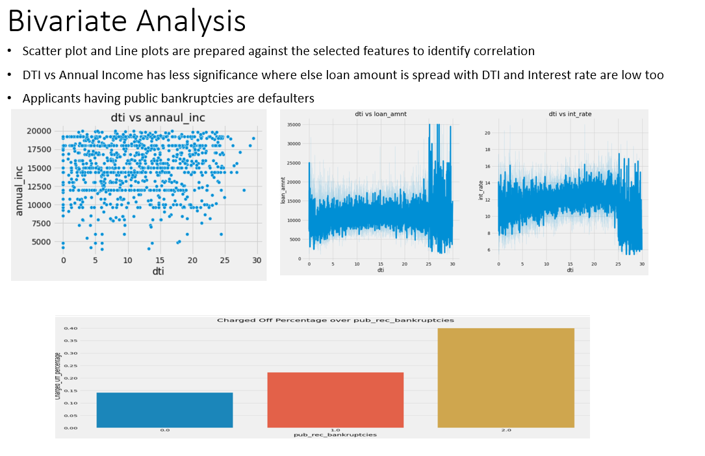
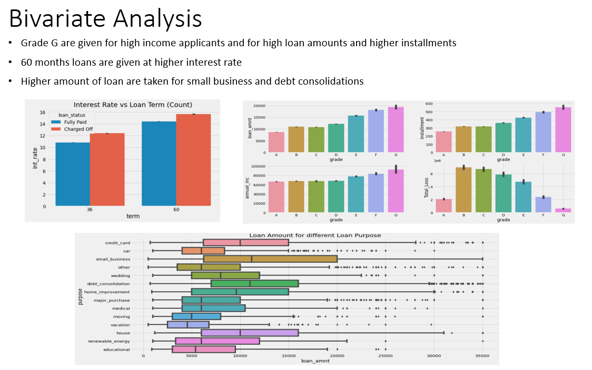
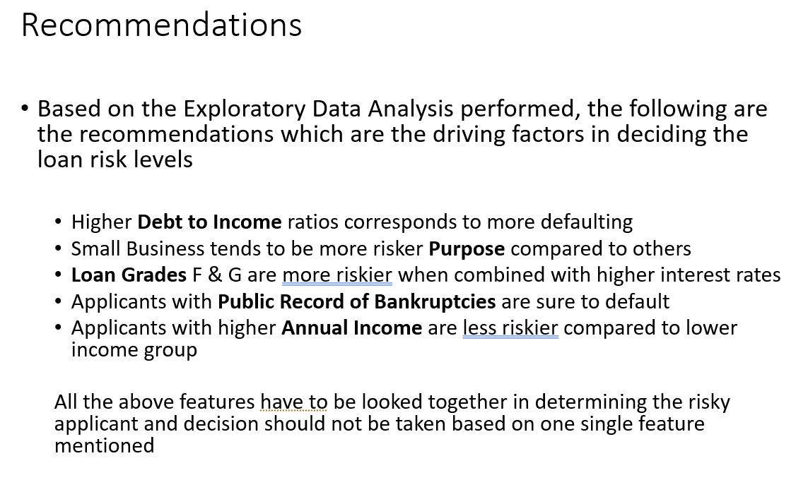

# Lending-Case-Study-Upgrad-
EDA For Lending Case Study

Download Links:
  [Python Jupiter notbook](https://github.com/abhinavswarupgit/Lending-Case-Study-Upgrad-/blob/main/Lending%20Club%20Case%20Study.ipynb)
  [HTML Read view](https://github.com/abhinavswarupgit/Lending-Case-Study-Upgrad-/blob/main/Lending%20Club%20Case%20Study.html)
  [Summary PPT](https://github.com/abhinavswarupgit/Lending-Case-Study-Upgrad-/blob/main/Lending%20Club%20Case%20Study.pptx)
  [Summary PDF](https://github.com/abhinavswarupgit/Lending-Case-Study-Upgrad-/blob/main/Lending%20Club%20Case%20Study_Analysis.pdf)

